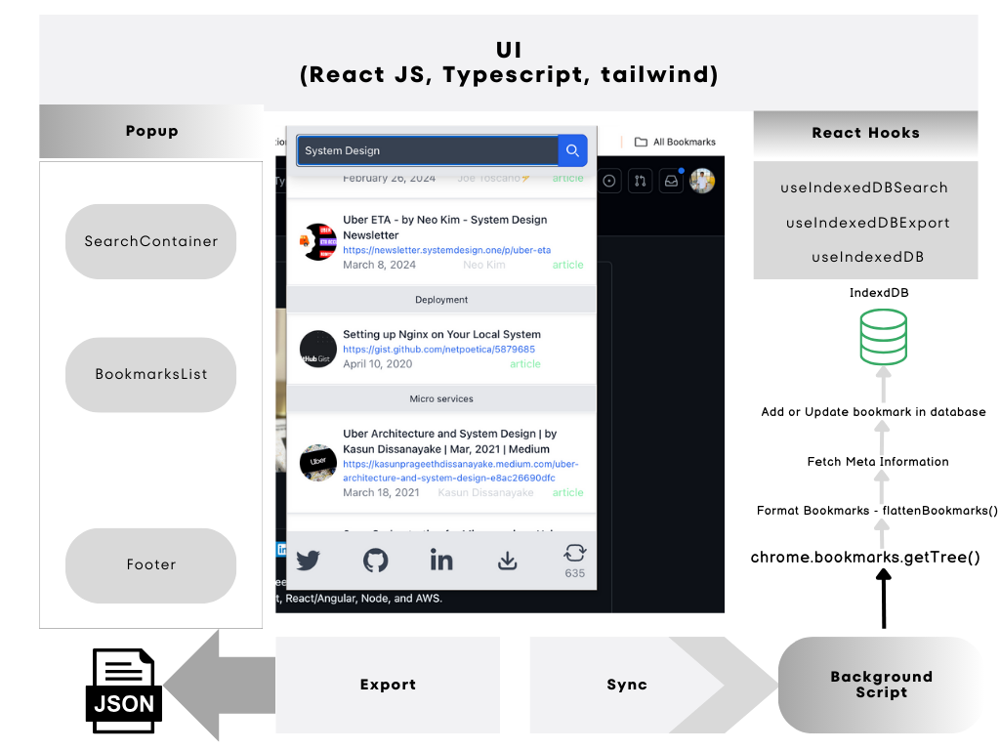

# Chrome Extension - React + TypeScript + Vite

This repository contains the basic setup for the Chrome extension to read bookmarks, store them in the index database, and search for them by keyword.

## Technology Stack

- Vite
- Typescript
- React JS
- Chrome Extension Components
- Indexdb
- tailwind

### Start the application

- Clone the Application `git clone https://github.com/santoshshinde2012/extension.git`
- Install the dependencies `npm install`
- Test the application in the browser `npm run dev`, but you can't test the Chrome Runtime API.
- Build the extension `npm run build`

### Test the chrome extension

- Build:  Create a build by using the build command.
- Open Chrome Extensions Page: Type chrome://extensions/ in the address bar and hit Enter.
- Enable Developer Mode: Toggle Developer mode switch to on.
- Load the Extension: Click "Load unpacked" and select the extension directory.
- Confirm Loading: Extension appears in the Extensions page.
- Test: Verify the extension functions properly.

### Chrome Extension Components:

- HTML/CSS/JS Development: This is where you develop the actual content and functionality of the extension using HTML, CSS, and JavaScript.
- Manifest: The manifest file (manifest.json) describes the extension, its permissions, and other crucial details required by Chrome.
- Background Script: This script runs in the background and handles events and interactions.
- Popup Page: The UI that appears when the extension icon is clicked. It typically provides quick access to the extension's features.
- External APIs: Many extensions interact with external APIs for data retrieval, authentication, or other services.
- User Interaction/UI: This represents the user interface of the extension as displayed in the browser, including any interaction points or UI elements.

### Connect with me on

  
  
   
  

